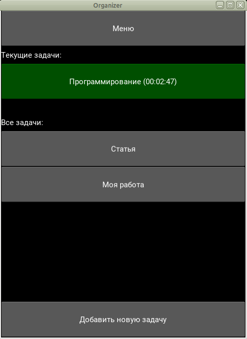
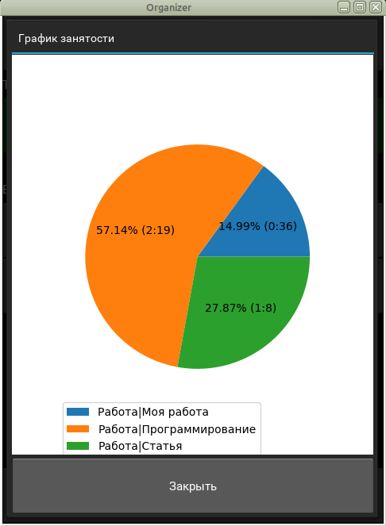
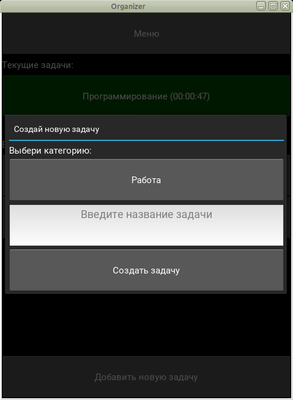

Самоконтроллер (Selfcontrolling)
=================================

English text see below

Это приложение позволяет вести контроль активности у компьютера. Оно позволяет:
* запускать задачу с таймером выполнения
* создавать новые задачи
* выводить график активности на экран.

В следующих итерациях планируется добавление следующих механизмов:
* запись графиков в файл
* сохранение информации об активности в табличном виде
* добавление параметров фильтрации
* добавление таймера-помидорро.

Основное окно программы:

Вывод графика активности по задачам:

Создание новой задачи:

**English version**

This application allows to control your activities on computer. Current
capabilities are:
* to start a task with a timer
* to create new tasks
* to show activity graphs.

